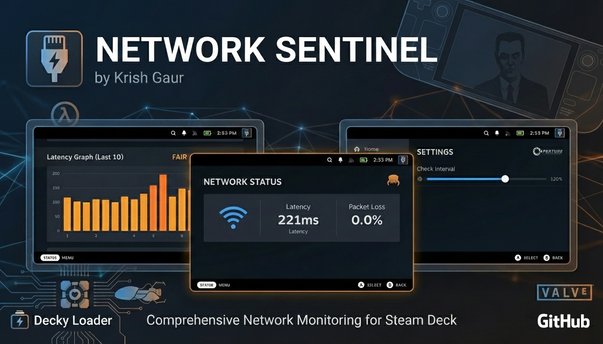
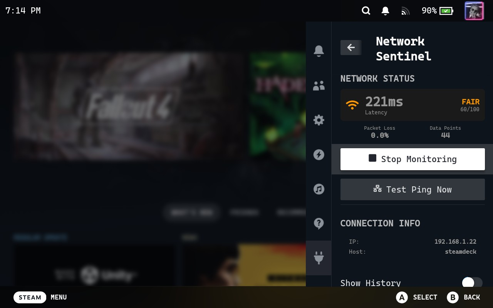
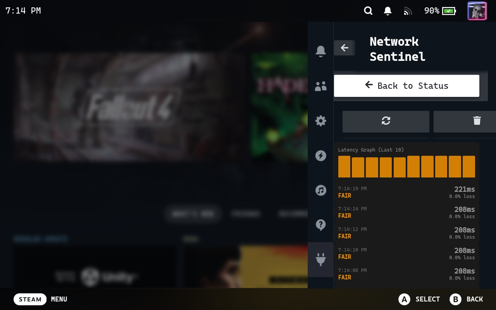
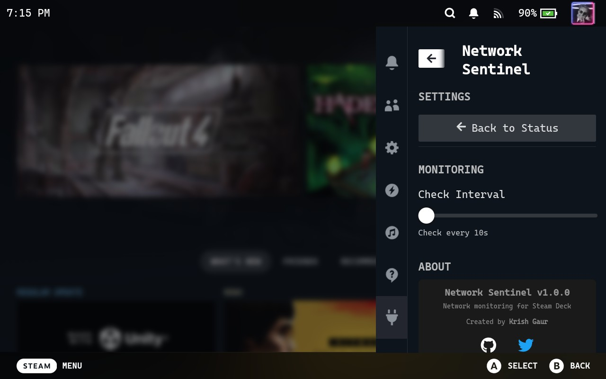

<div align="center">

# Network Sentinel

[](https://decky.xyz/)
[](LICENSE)
[](https://store.steampowered.com/steamdeck)
[](https://www.typescriptlang.org/)
[](https://www.python.org/)

**Real-time Network Quality Monitoring Plugin for Steam Deck**

A native Decky Loader plugin providing comprehensive network diagnostics, latency visualization, and connection quality metrics directly within the Steam Deck Quick Access Menu.

[Installation](#installation) | [Features](#features) | [Configuration](#configuration) | [Known Issues](#known-issues) | [Contributing](#contributing)

---



</div>

## Overview

Network Sentinel is a performance monitoring solution designed specifically for the Steam Deck platform. It provides real-time network telemetry including ICMP latency measurements, packet loss detection, and historical trend analysis through an integrated QAM (Quick Access Menu) interface. 

The plugin leverages asynchronous Python backend processes for network probing while maintaining a responsive React-based frontend, ensuring minimal system resource overhead during gameplay sessions.

## Screenshots

<table>
  <tr>
    <td align="center"><strong>Home Panel</strong></td>
    <td align="center"><strong>History Panel</strong></td>
    <td align="center"><strong>Settings Panel</strong></td>
  </tr>
  <tr>
    <td></td>
    <td></td>
    <td></td>
  </tr>
</table>

## Features

| Feature | Description |
|---------|-------------|
| **Real-time Latency Monitoring** | Continuous ICMP ping measurements with configurable target endpoints |
| **Packet Loss Detection** | Tracks connection stability through packet delivery success rates |
| **Connection Quality Scoring** | Algorithmic quality assessment (Excellent/Good/Fair/Poor) based on latency thresholds and jitter analysis |
| **Historical Data Visualization** | Time-series latency graphs with trend analysis and spike detection |
| **Network Interface Statistics** | Bandwidth utilization metrics via `psutil` system calls |
| **Persistent Overlay Display** | Optional always-visible ping indicator during gameplay |
| **Configurable Polling Intervals** | Adjustable monitoring frequency to balance accuracy vs. resource usage |

## Installation

### Decky Plugin Store (Recommended)

1. Access the **Decky Loader** menu via the Quick Access button
2. Navigate to the **Plugin Store** tab
3. Search for **"Network Sentinel"**
4. Select **Install** to download and activate the plugin

### Manual Installation

<details>
<summary>Expand for manual installation procedure</summary>

```bash
# Download latest release archive
wget https://github.com/KrishGaur1354/network-sentinel/releases/latest/download/network-sentinel. zip

# Extract to Decky plugins directory
unzip network-sentinel.zip -d /home/deck/homebrew/plugins/

# Restart Decky Loader service
systemctl --user restart plugin_loader. service
```

Alternatively, reload plugins from the Decky Loader settings menu.

</details>

## Configuration

| Parameter | Description | Default |
|-----------|-------------|---------|
| **Check Interval** | Polling frequency for network measurements (ms) | 5000 |
| **Monitoring Toggle** | Enable/disable active network probing | Disabled |
| **Overlay Display** | Show persistent ping indicator | Disabled |

Configuration changes are applied immediately without requiring plugin restart.

## Usage

1. **Initialize Monitoring**: Toggle the monitoring switch to begin network quality assessment
2. **Real-time Metrics**: View current latency, packet loss, and quality score on the home panel
3. **Historical Analysis**: Access the History tab for time-series latency visualization
4. **Configuration**: Adjust polling intervals and display preferences in Settings

## System Requirements

| Requirement | Specification |
|-------------|---------------|
| **Platform** | Steam Deck (SteamOS 3.0+) |
| **Dependency** | [Decky Loader](https://decky.xyz/) v2.0+ |
| **Python Runtime** | Python 3.10+ (included in SteamOS) |
| **Python Packages** | `psutil` (auto-installed) |

## Known Issues

### Blocking Issues

None currently identified. 

### Non-Blocking Issues

| Issue | Description | Status |
|-------|-------------|--------|
| **QAM History Panel Layout** | The "Refresh" and "Clear" action buttons exceed the QAM viewport width, causing horizontal scroll overflow and UI clipping when the "Clear" button receives focus.  | Under Investigation |

## Architecture

### Tech Stack

| Layer | Technology | Purpose |
|-------|------------|---------|
| **Frontend** | React 18, TypeScript 5.x | UI components and state management |
| **UI Framework** | @decky/ui | Native Steam Deck component library |
| **Backend** | Python 3.10+, asyncio | Asynchronous network operations |
| **System Interface** | psutil | Network interface statistics retrieval |
| **IPC** | Decky Plugin API | Frontend-backend communication |

### Project Structure

```
network-sentinel/
├── src/                    # TypeScript frontend source
│   ├── components/         # React UI components
│   └── index.tsx          # Plugin entry point
├── main.py                # Python backend service
├── package.json           # Node.js dependencies
└── plugin.json            # Decky plugin manifest
```

## Development

### Build from Source

```bash
# Clone repository
git clone https://github.com/KrishGaur1354/network-sentinel.git
cd network-sentinel

# Install Node.js dependencies
pnpm install

# Build production bundle
pnpm run build
```

### Deployment

**Linux/macOS:**
```bash
rsync -avz --delete dist/ deck@steamdeck:/home/deck/homebrew/plugins/network-sentinel/
```

**Windows (PowerShell):**
```powershell
.\deploy.ps1
```

### Development Resources

- [Decky Plugin Development Guide](https://docs.deckbrew.xyz/)
- [decky-frontend-lib Documentation](https://github.com/SteamDeckHomebrew/decky-frontend-lib)
- [Decky Loader Repository](https://github.com/SteamDeckHomebrew/decky-loader)

## Contributing

Contributions are welcome.  Please adhere to the following workflow:

1. Fork the repository
2. Create a feature branch: `git checkout -b feature/<feature-name>`
3.  Implement changes with appropriate test coverage
4.  Commit with conventional commit messages: `git commit -m 'feat: add feature description'`
5. Push to remote: `git push origin feature/<feature-name>`
6.  Submit a Pull Request with detailed description

For bug reports or feature requests, please open an issue using the appropriate template. 

## License

This project is licensed under the **BSD-3-Clause License**. See [LICENSE](LICENSE) for full terms.

## Author

**Krish Gaur**

[](https://github.com/KrishGaur1354)
[](https://twitter.com/ThatOneKrish)

---

<div align="center">

**Developed for the Steam Deck Community**

If this plugin enhances your gaming experience, consider starring the repository. 

</div>
